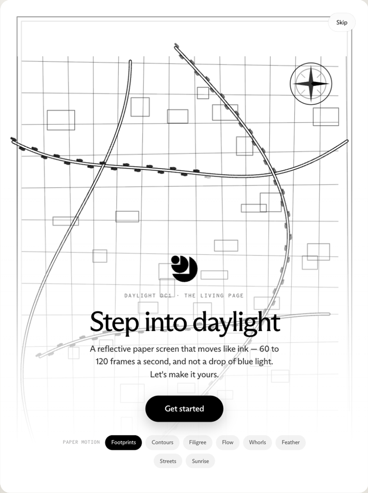
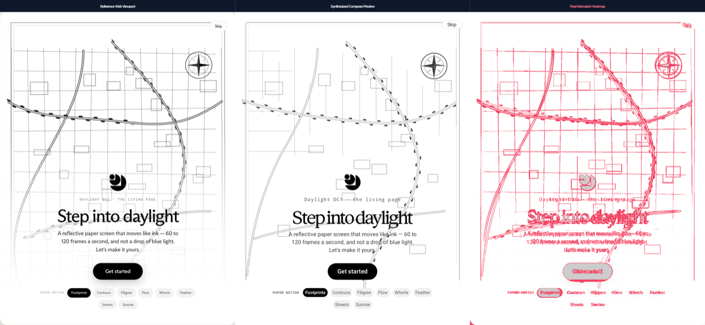

# Claude to Compose (claude-to-compose)

## Preview

Claude Design → Jetpack Compose pipeline: device reference + verification composite.





[](#test-results-summary)
[](#test-results-summary)
[](#technical-deep-dive)
[](#prerequisites)
[](LICENSE)

> A local, agent-assisted design-retrofit workbench for making an existing Android app look like captured Claude Design evidence without silently replacing the app's behavior. Visual and behavioral fidelity are measured outcomes, not implied by unit-test counts; missing build, render, geometry, or diff evidence is reported as `BLOCKED`.

## Note Overlay native proof (in progress)

The `codex/design-gallery-proof` branch contains a **separate synthetic-data
Android gallery** for the two owner-supplied Claude Design artifacts. It is not
a restyled Note Overlay build. Native Compose studies cover the floating
overlay and multiple e34f toolbar, glass, floating, rotation, interaction,
and mildliner directions. Each gallery entry is either a navigable native
study or visibly marked `BLOCKED`; these are not yet exact replicas. Both
references have verified static captures at portrait and landscape 4:3 outer
viewports. A deterministic source-to-agent packet identifies the real Java
overlay seam and supplies style/vector evidence, but does not generate Compose
code or prove fidelity by itself.

The latest measured exact-size da63 toolbar comparison is **FAIL** (4.040 MAE
against a provisional 4.0 pilot limit); an intentionally wrong toolbar scores
52.567. This is a narrow top-band comparison, not a full-screen match.
Passing Android/unit tests and the legacy 100% fixture badges do not change
that outcome. Motion, full UX coverage, real-app integration, and DC-1 device
checks remain `BLOCKED`. See [how to try the gallery](docs/pilot/TEST_GALLERY.md),
the [source inventory](docs/pilot/SCENE_MATRIX.md), and [visual evidence](docs/pilot/VISUAL_GATE.md).

## Design retrofit v1

The first testable v1 adds a fail-closed path intended for Codex, Claude Code, or another coding agent:

1. inspect a clean, committed Android baseline without mutating it;
2. combine the resulting app model with a captured design spec and agent-authored mapping/behavior manifests;
3. emit a versioned retrofit contract and a coding-agent packet;
4. implement only in a separate Git worktree; and
5. verify hash-pinned build, behavior, render, comparison, and provenance evidence as `PASS`, `FAIL`, or `BLOCKED`.

This is deliberately not advertised as a universal one-click web-to-Compose compiler. The existing extractor and synthesizer remain useful experimental lower layers, but a generated screen or green schema test is not accepted as fidelity evidence. Fixture replay proves the verifier, not a real app. The Note Overlay repository and two Claude Design links are now known; the owner has not selected a final direction, and no production graft is authorized before gallery validation.

```bash
git clone --branch codex/design-retrofit-v1 https://github.com/a12k-a2b/claude-to-compose.git
cd claude-to-compose
npm install
npm run test:v1
node bin/ctc.js doctor --json
```

See [the v1 quickstart](docs/v1/QUICKSTART.md), [the frozen artifact contract](docs/v1/V1_CONTRACT.md), and [the end-to-end project plan](docs/END_TO_END_PROJECT_PLAN.md). The v1 is local-first and does not require Railway or any hosted service.

The material below describes the original experimental pipeline and its
intended capabilities. In particular, its “pixel-perfect,” “production-ready,”
and pass-percentage language is **not** evidence that the supplied Claude
Design artifacts match native renders or that Note Overlay has been restyled.
Use the pilot evidence and fail-closed v1 reports for current acceptance.

---

## Table of Contents

1. [Design retrofit v1](#design-retrofit-v1)
2. [Project Overview & Architecture](#project-overview--architecture)
3. [Installation & Prerequisites](#installation--prerequisites)
4. [CLI Usage & Command Manual](#cli-usage--command-manual)
   - [1. Headless Extractor CLI (`claude-extract`)](#1-headless-extractor-cli-claude-extract)
   - [2. Compose Synthesizer CLI](#2-compose-synthesizer-cli)
   - [3. Custom Antigravity Skill & Multi-Agent Workflow (`/claude-to-compose`)](#3-custom-antigravity-skill--multi-agent-workflow-claude-to-compose)
   - [4. Dual Verification Suite](#4-dual-verification-suite)
   - [5. E2E & Adversarial Test Runner](#5-e2e--adversarial-test-runner)
5. [Technical Deep Dive](#technical-deep-dive)
   - [Extractor Engine & Hydration Barrier](#extractor-engine--hydration-barrier)
   - [Jetpack Compose & UX Synthesizer](#jetpack-compose--ux-synthesizer)
   - [Dual Verification Harness & 10-Point Rubric](#dual-verification-harness--10-point-rubric)
6. [End-to-End Walkthrough: SaaS Analytics Dashboard](#end-to-end-walkthrough-saas-analytics-dashboard)
7. [Test Results Summary](#test-results-summary)
8. [Repository Layout](#repository-layout)
9. [License](#license)

---

## Project Overview & Architecture

Translating rich web designs into idiomatic, maintainable Android Jetpack Compose code requires more than naive AST or string replacement. Modern web artifacts rely on complex CSS layout trees (flexbox, CSS grid), computed dynamic colors, nested vector graphics, web hover/focus interaction states, and dynamic hydration.

The original `claude-to-compose` prototype approaches this with a **5-stage
experimental transformation and verification pipeline**:

```
+─────────────────────────────────────────────────────────────────────────────+
|                         INPUT INGESTION PHASE                               |
|   Claude Shareable URL (claude.site, claude.ai/share) OR Local HTML / CSS   |
+──────────────────────────────────────┬──────────────────────────────────────+
                                       │
                                       ▼
+─────────────────────────────────────────────────────────────────────────────+
|                   PLAYWRIGHT HEADLESS EXTRACTION ENGINE                     |
|  - Ephemeral HTTP Server for Local Artifacts                                |
|  - Frame-Piercing for Sandboxed claudeusercontent.com Iframes               |
|  - 5-Phase Hydration Barrier (Network, DOM, Fonts, CSS, Settling)           |
|  - Computed Layout, Typography, Colors, Elevation, and Radii Extraction    |
|  - Inline & External SVG Vector Path Parsing and Normalization              |
|  - High-Res Multi-Viewport Screenshots (Mobile 3x: 1170x2532, Desktop 2x)   |
+──────────────────────────────────────┬──────────────────────────────────────+
                                       │
                                       ▼
+─────────────────────────────────────────────────────────────────────────────+
|               INTERMEDIATE SPECIFICATION: design_spec.json                  |
|  - JSON Schema Draft 2020-12 Conformance                                    |
|  - Normalized Theme Tokens (Colors, Type Scale, Elevation, Shape)           |
|  - Structured DOM Hierarchy with Coordinates, Flex/Grid, Interactions       |
|  - Extracted Vector Assets in Asset Bundle                                  |
+──────────────────────────────────────┬──────────────────────────────────────+
                                       │
                                       ▼
+─────────────────────────────────────────────────────────────────────────────+
|                     JETPACK COMPOSE & UX SYNTHESIZER                        |
|  - Material 3 Design Tokens (Theme.kt, Color.kt, Type.kt, Elevation.kt)    |
|  - Modular Atomic Composables (Buttons, Cards, Inputs, Badges, Chips)       |
|  - Full Screen Assembly (ClaudeDesignScreen.kt) with rememberSaveable       |
|  - SVG-to-Compose ImageVector DSL (ClaudeIcons.kt) & Android VectorDrawable |
|  - Motion & Interaction Translation (Touch ripples, >= 48dp touch targets)  |
|  - Dual Theme Previews (@Preview for Light & Dark Schemes)                  |
+──────────────────────────────────────┬──────────────────────────────────────+
                                       │
                                       ▼
+─────────────────────────────────────────────────────────────────────────────+
|                      ANDROID PROJECT TARGET (android/)                      |
|  - Gradle 8.11.1 + Android Gradle Plugin 8.10.1 + Kotlin 2.0.21             |
|  - Jetpack Compose BOM 2024.10.01 + Material 3                              |
|  - Robolectric Native Graphics Preview Test (PreviewScreenshotTest.kt)     |
+──────────────────────────────────────┬──────────────────────────────────────+
                                       │
                                       ▼
+─────────────────────────────────────────────────────────────────────────────+
|                           DUAL VERIFICATION SUITE                           |
|  - Programmatic Build & Lint: ./gradlew compileDebugKotlin (0 errors)       |
|  - Headless Preview Capture: ./gradlew testDebugUnitTest                    |
|  - Programmatic Visual Diff: Pixelmatch + SSIM.js Perceptual Diff           |
|  - Agent-as-Judge 10-Point Audit Rubric (>= 90 Pass Threshold)              |
|  - Touch Target Compliance Rule (>= 48dp Hard Veto)                         |
|  - Markdown Verification Report (verification_report.md) with Diffs         |
+─────────────────────────────────────────────────────────────────────────────+
```

---

## Installation & Prerequisites

### Prerequisites

| Tool | Required Version | Verification Command | Notes |
|---|---|---|---|
| **Node.js** | `>= 18.0.0` | `node --version` | Node 20+ LTS recommended |
| **npm** | `>= 9.0.0` | `npm --version` | Package manager |
| **JDK** | `17` | `javac -version` | Required for Android Gradle builds |
| **Android SDK** | `API 35` | `echo $ANDROID_HOME` | Platforms 34/35 & Build-Tools 35.0.0 |
| **Gradle** | `8.11.1` | `./gradlew --version` | Bundled in `android/gradle/wrapper/` |
| **Playwright** | Chromium | `npx playwright --version` | Headless extraction browser |
| **GitHub CLI** | `>= 2.40.0` | `gh --version` | Repository publishing & release management |

### Setup Instructions

1. **Clone the Repository**:
   ```bash
   git clone https://github.com/a12k-a2b/claude-to-compose.git
   cd claude-to-compose
   ```

2. **Install Node.js Dependencies**:
   ```bash
   npm install
   ```

3. **Install Playwright Browsers**:
   ```bash
   npx playwright install chromium
   ```

4. **Configure Android SDK**:
   Ensure `ANDROID_HOME` or `ANDROID_SDK_ROOT` is exported, or create `android/local.properties`:
   ```properties
   sdk.dir=/Users/YOUR_USERNAME/Library/Android/sdk
   ```

5. **Make CLI Tools Executable**:
   ```bash
   chmod +x bin/claude-extract.js examples/run_example.js skills/claude-to-compose/workflow.js
   ```

---

## CLI Usage & Command Manual

### 1. Headless Extractor CLI (`claude-extract`)

The extractor engine ingests public Claude shareable URLs or local HTML/CSS files and emits `design_spec.json`, extracted SVG assets, and reference screenshots.

```bash
node bin/claude-extract.js [options] [input]
```

#### CLI Options:
| Flag | Description | Default |
|---|---|---|
| `-u, --url <url>` | Explicit Claude shareable URL (`claude.site/...`, `claude.ai/share/...`) | — |
| `-f, --file <path>` | Path to local HTML file or artifact folder | — |
| `-o, --output <dir>` | Output directory for spec, screenshots, and assets | `./output` |
| `--viewport <type>` | Viewports to extract: `mobile`, `desktop`, or `both` | `both` |
| `--mobile-width <px>` | Mobile viewport width in CSS pixels | `390` |
| `--mobile-height <px>` | Mobile viewport height in CSS pixels | `844` |
| `--mobile-scale <dpr>` | Mobile device pixel ratio scale factor | `3` (1170x2532) |
| `--desktop-width <px>` | Desktop viewport width in CSS pixels | `1440` |
| `--desktop-height <px>` | Desktop viewport height in CSS pixels | `900` |
| `--desktop-scale <dpr>` | Desktop device pixel ratio scale factor | `2` (2880x1800) |
| `--clean` | Clean output directory prior to extraction | `false` |
| `-t, --timeout <ms>` | Maximum navigation and hydration timeout | `30000` |
| `--debug` | Enable verbose diagnostic logging | `false` |

#### Examples:
```bash
# Extract from a public Claude shareable link
node bin/claude-extract.js https://claude.site/artifacts/4a1b2c3d -o ./output/my_screen

# Extract from a local HTML fixture
node bin/claude-extract.js tests/fixtures/s1_saas_dashboard/index.html -o ./output/saas_dashboard

# Extract only mobile viewport with clean output
node bin/claude-extract.js --file fixtures/sample_dashboard.html -o ./output/mobile_spec --viewport mobile --clean
```

---

### 2. Compose Synthesizer CLI

The synthesizer ingests `design_spec.json` and generates an idiomatic Material 3 Jetpack Compose codebase.

```bash
node synthesizer/index.js --spec <path-to-spec> [options]
```

#### Options:
- `--spec, -s <path>`: Path to `design_spec.json` (**required**).
- `--output, -o <dir>`: Target directory for generated Kotlin and XML files (defaults to `android/app/src/main`).
- `--package, -p <pkg>`: Base Kotlin package name (default: `com.claude.compose`).

#### Example:
```bash
node synthesizer/index.js --spec ./output/saas_dashboard/design_spec.json --output android/app/src/main
```

#### Emitted Architecture:
- `java/com/claude/compose/theme/`: `Theme.kt`, `Color.kt`, `Type.kt`, `Shape.kt`, `Elevation.kt`
- `java/com/claude/compose/components/`: `AppButton.kt`, `AppCard.kt`, `AppTextField.kt`, `AppBadge.kt`, `AppCheckbox.kt`, `AppRadioButton.kt`, `AppNavigation.kt`, `AppChip.kt`
- `java/com/claude/compose/screen/`: `ClaudeDesignScreen.kt`, `ClaudeDesignPreview.kt`
- `java/com/claude/compose/icons/`: `ClaudeIcons.kt` (`ImageVector` builder DSL)
- `java/com/claude/compose/motion/`: `TouchTarget.kt` (>= 48dp compliance), `MotionTokens.kt`
- `res/drawable/`: `ic_icon_*.xml` (Android XML VectorDrawables)

---

### 3. Custom Antigravity Skill & Multi-Agent Workflow (`/claude-to-compose`)

`claude-to-compose` includes an Antigravity custom skill and multi-agent workflow definition (`skills/claude-to-compose/SKILL.md`).

#### The 4 Specialized Agent Roles:
1. **Extractor Agent** (`prompts/extractor_agent.md`): Ingests the design URL or HTML, operates the headless engine, and outputs `design_spec.json`.
2. **Compose Architect Agent** (`prompts/compose_architect_agent.md`): Translates tokens, creates atomic composables with state hoisting, and builds screens.
3. **Motion & UX Specialist Agent** (`prompts/motion_specialist_agent.md`): Maps hover/focus to touch ripples, enforces >= 48dp touch targets, and sets up transitions.
4. **Visual QA Agent** (`prompts/visual_qa_agent.md`): Runs the dual verification suite, inspects diffs, evaluates the audit rubric, and gates delivery.

#### Running the Multi-Agent Orchestrator:
```bash
# Execute full workflow on a local HTML fixture
node skills/claude-to-compose/workflow.js --input tests/fixtures/s1_saas_dashboard/index.html

# Execute with Gradle build bypass (for headless CI without Android SDK)
node skills/claude-to-compose/workflow.js --input examples/saas_dashboard/input/index.html --skip-gradle
```

---

### 4. Dual Verification Suite

The verification harness validates compilation, visual fidelity, and UX compliance:

```bash
# Run full verification pipeline (Build -> Preview Capture -> Visual Diff -> 10-Point Audit -> Report)
node verification/index.js --ref output/saas_dashboard/screenshots/mobile_reference.png --rendered android/app/build/outputs/preview/rendered_preview.png

# Run standalone perceptual visual diff (Pixelmatch + SSIM)
node verification/run_diff.js --ref output/saas_dashboard/screenshots/mobile_reference.png --rendered android/app/build/outputs/preview/rendered_preview.png --output output/diff_results

# Run standalone 10-point Agent-as-Judge audit rubric
node verification/audit_rubric.js --scores '{"layout":10,"color":10,"typography":10,"touchTargets":10,"ripple":10,"elevation":10,"responsive":10,"states":10,"theme":10,"codeHygiene":10}'

# Execute Robolectric headless preview screenshot capture
cd android && ./gradlew testDebugUnitTest
```

---

### 5. E2E & Adversarial Test Runner

The project features an automated, opaque-box multi-tier test runner:

```bash
# Run full test suite (Tiers 1-4: 284 tests)
npm test

# Run specific tiers
npm run test:tier1    # Tier 1: 120 Feature tests
npm run test:tier2    # Tier 2: 120 Boundary tests
npm run test:tier3    # Tier 3: 24 Integration Combination tests
npm run test:tier4    # Tier 4: 20 Real-World Workload tests

# Run Unit tests
npm run test:unit     # 20 Subsystem Unit tests

# Run Tier 5 Adversarial Hardening suites
node tests/tier5_adversarial/test_m6_verification_workflow_adversarial.js  # 61 tests
node tests/tier5_adversarial/test_m6_extractor_synthesizer_adversarial.js  # 26 tests
node tests/adversarial/run_m4_rubric_report_adversarial.js                 # 89 tests
node tests/adversarial/run_m3_adversarial_suite.js                         # 41 tests
node tests/adversarial/run_adversarial_suite.js                            # 12 tests
```

---

## Technical Deep Dive

### Extractor Engine & Hydration Barrier

- **Ephemeral HTTP Server**: Local HTML files often fail when loaded via `file://` due to CORS restrictions on fonts, external stylesheets, and web workers. The extractor spins up an in-memory HTTP server with randomized open ports and proper MIME headers.
- **Frame-Piercing**: Claude Design shareable links host their interactive artifacts inside sandboxed iframes (`claudeusercontent.com`). The engine locates and attaches directly to the inner browsing context.
- **5-Phase Hydration Synchronization**:
  1. `networkidle`: Wait until all network connections cease for >= 500ms.
  2. `DOM ready`: Await `DOMContentLoaded` and presence of root elements (`#root`, `main`, etc.).
  3. `Tailwind / CSS CDN`: Wait for stylesheet evaluation and CSS variables resolution.
  4. `Document Fonts`: Execute `document.fonts.ready` before reading geometry.
  5. `Settling Delay`: Enforce an animation stabilization interval before screenshotting.
- **Draft 2020-12 Schema Validation**: The extracted output is sanitized against `Infinity` and `NaN` values and validated against JSON Schema Draft 2020-12.

### Jetpack Compose & UX Synthesizer

- **Material 3 Tokens**: Colors are converted to 32-bit `Color(0xFF...)` hex representations; type scales are converted to `.sp` values with standard `FontWeight` mappings (`FontWeight.W100` to `FontWeight.W900`); corner radii are extracted and translated into `RoundedCornerShape`.
- **Atomic Components with State Hoisting**: Components never hardcode mutable state. All interactions emit `onAction: () -> Unit` or `onValueChange: (T) -> Unit`.
- **Touch Target Compliance (>= 48dp)**: Android accessibility requires touch targets of at least 48x48dp. The synthesizer wraps all buttons, chips, and clickable containers with `minimumInteractiveComponentSize()` or `defaultMinSize(minWidth = 48.dp, minHeight = 48.dp)`.
- **Vector DSL & Drawables**: Extracted SVGs are converted to both `ClaudeIcons.kt` (using `ImageVector.Builder`) and Android XML `VectorDrawable`s in `res/drawable/`.
- **Motion & Interaction Translation**: Web hover states are translated to native Android touch ripples and elevation lifts using `interactionSource.collectIsPressedAsState()` and `animateDpAsState()`.

### Dual Verification Harness & 10-Point Rubric

Visual and architectural verification is enforced across multiple gates:

1. **Pixelmatch Perceptual Diffing**: Pixel-by-pixel color distance analysis with anti-aliasing detection.
2. **SSIM Structural Similarity**: Multi-scale structural similarity index (MSSIM) assessing luminance, contrast, and structure fidelity (target: `>= 0.90`).
3. **10-Point Agent-as-Judge Rubric**:
   - Layout Structure & Hierarchy Fidelity (10 pts)
   - Color Palette & M3 Token Mapping (10 pts)
   - Typography Scale & Font Sizing (10 pts)
   - Touch Target Compliance (>= 48dp) (10 pts) — **CRITICAL VETO RULE**
   - Ripple & Interaction Feedback (10 pts)
   - Elevation, Shadow & Surface Styling (10 pts)
   - Responsive Layout & Flow Wrapping (10 pts)
   - State Hoisting & Event Handling (10 pts)
   - Theme & Dark Mode Compliance (10 pts)
   - Code Hygiene, Modularity & Naming (10 pts)

> **The Hard Veto Rule**: If any single category scores `< 5`, or if any touch target in interactive elements is `< 48dp` without interactive component padding, an automatic veto is triggered, the overall score fails (`hasVeto = true`), and the pipeline gates publication and initiates a refinement iteration.

---

## End-to-End Walkthrough: SaaS Analytics Dashboard

Follow this step-by-step walkthrough to extract, synthesize, and verify a complete SaaS dashboard:

### Step 1: Run Extraction on the Fixture
```bash
node bin/claude-extract.js tests/fixtures/s1_saas_dashboard/index.html -o output/saas_walkthrough --viewport both
```
**Output**: Emits `output/saas_walkthrough/design_spec.json`, 5 extracted SVG icons, and 4 high-resolution reference screenshots.

### Step 2: Synthesize Android Jetpack Compose Code
```bash
node synthesizer/index.js --spec output/saas_walkthrough/design_spec.json --output android/app/src/main
```
**Output**: Emits 23 Kotlin source files and Android XML drawables:
- `android/app/src/main/java/com/claude/compose/theme/` (Theme, Color, Type, Shape, Elevation)
- `android/app/src/main/java/com/claude/compose/components/` (Button, Card, TextField, Badge, Checkbox, RadioButton, Navigation, Chip)
- `android/app/src/main/java/com/claude/compose/screen/ClaudeDesignScreen.kt`

### Step 3: Compile the Android Project
```bash
cd android
./gradlew compileDebugKotlin
```
**Output**: BUILD SUCCESSFUL (0 compilation errors).

### Step 4: Capture Robolectric Preview Screenshot
```bash
./gradlew testDebugUnitTest
```
**Output**: Renders `ClaudeDesignScreen` via Robolectric Native Graphics and writes `android/app/build/outputs/preview/rendered_preview.png`.

### Step 5: Execute Visual Diff Analysis
```bash
cd ..
node verification/run_diff.js \
  --ref output/saas_walkthrough/screenshots/mobile_reference.png \
  --rendered android/app/build/outputs/preview/rendered_preview.png \
  --output output/verification_diff
```
**Output**: Produces `diff_overlay.png` and `composite.png`. The measured metrics depend on the input and do not pass unless every configured global and localized gate is satisfied.

### Step 6: Generate the Comprehensive Verification Report
```bash
node verification/index.js \
  --ref output/saas_walkthrough/screenshots/mobile_reference.png \
  --rendered android/app/build/outputs/preview/rendered_preview.png \
  --output ./output/verification_report
```
**Output**: Generates `verification_report.md` embedding all diff images, audit scores, and gate verdicts.

---

## Test Results Summary

Test counts are reported separately from product-fidelity acceptance. Many legacy tests validate helpers, schemas, or code-shape contracts; they do not prove that a generated native screen matches its source design.

A release-quality `PASS` now requires all of the following evidence in the same run:

- Kotlin compilation and the native preview render actually executed and succeeded.
- Vector completeness and the static Compose audit succeeded.
- Pixel similarity, MSSIM, foreground Ink IoU, and contour alignment meet their configured thresholds.
- At least one semantic element was measured, element bounding-box IoU passes, and maximum spatial drift is within budget.
- No required stage or metric was skipped or missing. Missing evidence is `BLOCKED`, never pass.

Run `npm test` and `npm run test:unit` for subsystem checks, then run the verification pipeline against the exact generated artifact for fidelity acceptance. See [the architecture gap analysis](docs/ARCHITECTURE_GAP_ANALYSIS.md) for the supported-subset and motion roadmap.

---

## Repository Layout

```
claude-to-compose/
├── .gitignore                            # Strict ignore rules (no caches, builds, or node_modules)
├── package.json                          # Node.js project manifest & script commands
├── README.md                             # Production-grade documentation & architecture manual
├── verification_report.md                # Automated audit report with embedded diff composite
├── bin/
│   └── claude-extract.js                 # Standalone extraction CLI (chmod +x)
├── extractor/                            # R1 Headless Extraction Engine
│   ├── engine.js                         # Playwright browser lifecycle & hydration barrier
│   ├── dom_walker.js                     # DOM layout computation, typography & color token resolution
│   ├── svg_parser.js                     # Inline/external SVG parser & coordinate normalizer
│   ├── screenshotter.js                  # High-resolution mobile (3x) & desktop (2x) capture
│   ├── schema.json                       # JSON Schema Draft 2020-12 definition
│   └── spec_builder.js                   # design_spec.json assembler & color token scorer
├── synthesizer/                          # R2 Jetpack Compose Synthesizer
│   ├── index.js                          # Synthesis orchestrator CLI & programmatic entrypoint
│   ├── token_generator.js                # Theme.kt, Color.kt, Type.kt, Shape.kt, Elevation.kt
│   ├── component_generator.js            # Modular atomic composables with state hoisting
│   ├── screen_generator.js               # ClaudeDesignScreen.kt & @Preview generator
│   ├── vector_generator.js               # ImageVector DSL (ClaudeIcons.kt) & XML VectorDrawable
│   └── motion_generator.js               # Touch target helpers, ripple tokens, spring animations
├── android/                              # Synthesized Android Project
│   ├── build.gradle.kts                  # Root build script (Gradle 8.11.1)
│   ├── settings.gradle.kts               # Project repository settings
│   ├── gradle/wrapper/                   # Gradle wrapper binaries
│   └── app/
│       ├── build.gradle.kts              # AGP 8.10.1, Kotlin 2.0.21, Compose BOM 2024.10
│       └── src/
│           ├── main/
│           │   ├── AndroidManifest.xml
│           │   ├── java/com/claude/compose/
│           │   │   ├── theme/            # Material 3 tokens
│           │   │   ├── components/       # Atomic composables
│           │   │   ├── screen/           # ClaudeDesignScreen.kt & DaylightOnboardingScreen.kt
│           │   │   ├── icons/            # ClaudeIcons.kt ImageVector definitions
│           │   │   └── motion/           # TouchTarget.kt & MotionTokens.kt
│           │   └── res/drawable/         # ic_icon_*.xml VectorDrawables
│           └── test/java/com/claude/compose/
│               └── PreviewScreenshotTest.kt  # Robolectric Native Graphics headless renderer
├── skills/
│   └── claude-to-compose/                # R3 Antigravity Custom Skill
│       ├── SKILL.md                      # Antigravity skill definition & slash workflow
│       ├── workflow.js                   # Executable 4-phase pipeline runner
│       └── prompts/                      # 4 Agent role specifications
│           ├── extractor_agent.md
│           ├── compose_architect_agent.md
│           ├── motion_specialist_agent.md
│           └── visual_qa_agent.md
├── verification/                         # R4 Dual Verification Suite
│   ├── index.js                          # Unified verification pipeline entrypoint
│   ├── run_diff.js                       # Pixelmatch & SSIM perceptual diff runner
│   ├── audit_rubric.js                   # 10-point Agent-as-Judge evaluator & veto checker
│   ├── build_runner.js                   # Programmatic Gradle compilation & test runner
│   └── report_generator.js               # Markdown verification report builder
├── examples/                             # M7 Working Examples & Walkthroughs
│   ├── README.md                         # Examples directory guide
│   ├── run_example.js                    # Automated runnable example pipeline script
│   └── saas_dashboard/                   # SaaS Dashboard fixture, extracted spec & assets
│       ├── README.md
│       ├── input/                        # index.html, styles.css
│       └── extracted/                    # design_spec.json, screenshots, assets
└── tests/                                # Multi-Tier Dual-Track Test Harness
    ├── e2e_runner.js                     # Unified E2E test runner (Tiers 1-4)
    ├── fixtures/                         # Multi-tier HTML/CSS workload fixtures (S1 - S5)
    ├── tier1_features/                   # 120 Feature tests
    ├── tier2_boundaries/                 # 120 Boundary tests
    ├── tier3_combinations/               # 24 Combination tests
    ├── tier4_real_world/                 # 20 Scenario tests
    ├── tier5_adversarial/                # White-box stress testing suites
    ├── adversarial/                      # Ingestion & rubric adversarial suites
    └── unit/                             # Subsystem unit tests
```

---

## License

This project is licensed under the MIT License. See [LICENSE](LICENSE) for details.
